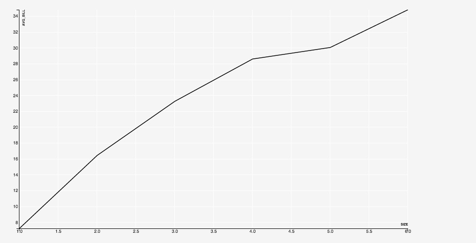
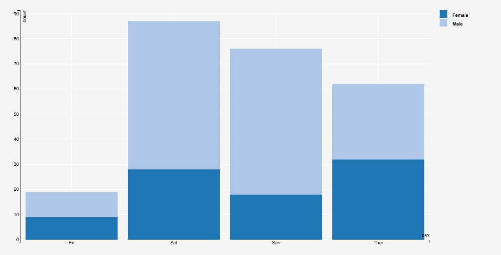
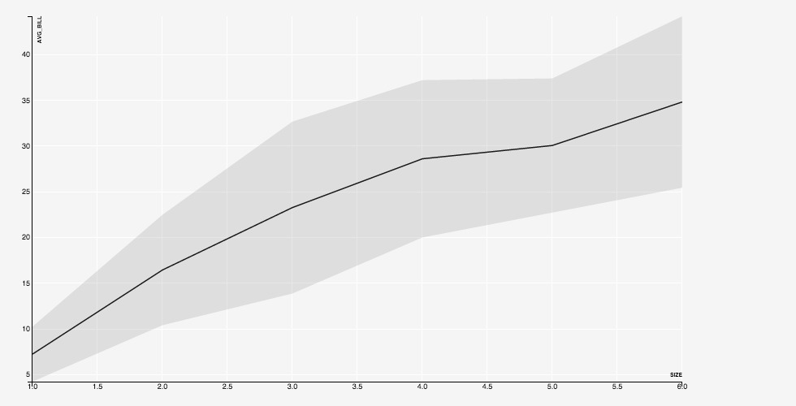
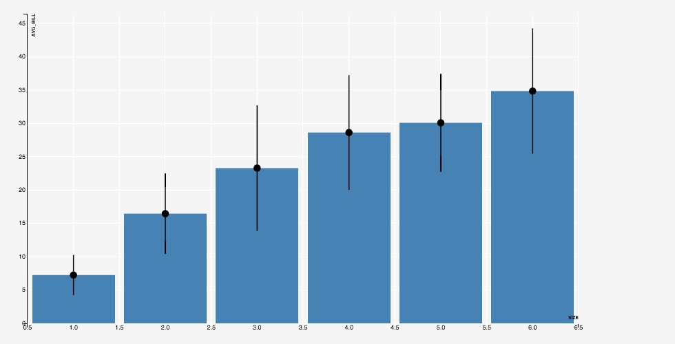

Sclera's visualization component, ScleraViz, enables quick and easy visualization of your query results. ScleraViz is integrated with [ScleraSQL](../sclerasql/sqlintro.md); this means a few lines of ScleraSQL can fetch, clean, analyze and visualize your data in a single sweep.

ScleraViz is inspired by [Grammar of Graphics](http://vita.had.co.nz/papers/layered-grammar.html), specifically [R's ggplot2](http://ggplot2.org/) -- but is implemented as an extension to [ScleraSQL](../sclerasql/sqlintro.md) and uses [D3](http://d3js.org) as the rendering engine. Moreover, unlike ggplot2, ScleraViz can clean, analyze and plot *streaming* data.

An online preview, with a number of examples with code, is available at [https://scleraviz.herokuapp.com](https://scleraviz.herokuapp.com).

## Command Line Setup

*In the following, `<sclera-root>` is the directory where Sclera is (or, is to be) installed.*

To run ScleraViz queries, you need to:

- Install Sclera Command Line using `scleradmin` ([detailed instructions here](../setup/install.md#installing-and-maintaining-sclera-command-line-application))

        $ scleradmin --install --root <sclera-root>

- Install the [Sclera Web Display](../setup/components.md#sclera-webdisplay) plugin

        $ scleradmin --add sclera-plugin-webdisplay --root <sclera-root>

- If you need to read CSV data, install the [CSV](../setup/components.md#sclera-csv-file-connector) plugin as well

        $ scleradmin --add sclera-plugin-csv --root <sclera-root>

- Start the Sclera Command Line Shell

        $ <sclera-root>/bin/sclera
        Welcome to Sclera 4.0

        > _

- In the Sclera Command Line Shell, start the display web server:

        Welcome to Sclera 4.0

        > display start;
        HTTP server started at port 7070
        Please point your browser to http://localhost:7070

    To start the server at a port other than 7070, you need to specify the port number explicitly at the end. For example, `display start 8080;` starts the server at `localhost:8080`.

- Start a web browser and open the URL [http://localhost:7070](http://localhost:7070)

Running a ScleraViz query (described in the rest of this document) on the Sclera Command Line will display the visualization in the browser. In addition, to display the contents of a query as a table in the browser, you can say:

    > display <query>;

For example, the following displays the result as a two column, single row table in the browser:

    > display select 'Hello' as greeting1, 'World' as greeting2;

Leaving the keyword `display` out displays the result in the command line shell, as usual.

You can also display arbitrary text (say, comments) as well:

    > display "The plot above is amazing!";

When done, you can close the display web server by saying:

    > display stop;

## Example Dataset

In the following, we will be using the ["tipping" dataset](https://vincentarelbundock.github.io/Rdatasets/doc/reshape2/tips.html) as our running example. The data set contains information about tips received by a waiter in a restaurant over a period of time. The information includes the tip in dollars, total bill in dollars, gender of the bill payer, whether there were smokers in the party, day of the week, time of day, and size of the party. Further details on the data can be found [here](https://vincentarelbundock.github.io/Rdatasets/doc/reshape2/tips.html).

To use the dataset, set up the `tips` table as follows:

    CREATE TEMP TABLE tips as
    EXTERNAL CSV("http://scleraviz.herokuapp.com/assets/data/tips.csv")
    TYPEINFER(LIMIT 1);

**Notation:** In the above and the following examples, the ScleraSQL keywords will be capitalized. This is for illustrative reasons only; ScleraSQL is case-insensitive.

## ScleraViz by Example

This section very briefly introduces the rudiments of the plot specification. This is to quickly get you started on plotting your own graphs. A complete and formal description of the syntax appear in the [next section](#detailed-syntax).

### A Simple Plot

Putting a `PLOT` afer the query plots the column `y` in the query result against the column `x` in the query result as a scatter plot. So, to plot the `tip` against the `total_bill` in the tipping dataset, we say:

    SELECT total_bill as x, tip AS y FROM tips
    PLOT;

The above statement works on a bunch of defaults  -- it creates a scatter-plot, which takes column `x` in the input as the default for the X coordinate, and column `y` in the input as the default for the `y` coordinate, and also takes default values for aesthetics such as point fill and stroke color, size, opacity (alpha), etc.

In the discussion that follows, we show how to explicitly override these defaults, and even vary them as a function of the data.

### Specifying the Geometry

A "geometry" refers to the manner in which a data point maps to the chart. In the scatterplot example above, the geometry is a `POINT`.

We can explicitly specify the geometry as follows:

    SELECT total_bill as x, tip AS y FROM tips
    PLOT(GEOM=POINT)

The location of a geometry is determined by a set of parameters. By default, these parameters are mapped to appropriately named columns in the input. For instance, each point above is placed according to the values in the `x` and `y` columns.

We can override this default by explicitly specifing custom columns for these parameters. So, another way to write the example above is:

    tips PLOT(GEOM=POINT(x=total_bill, y=tip))

Here, the parameters `x` and `y` are mapped to input columns `psavert` and `unemploy`; in general, they can be mapped to arbitrary expressions.

Sclera supports a number of alternative geometries.

For instance, to plot the average bill for a given party size against the party size as a histogram, we can say:

    SELECT `size`, AVG(total_bill) as avg_bill
    FROM tips
    GROUP BY `size`
    PLOT(GEOM=BAR(x=`size`, y=avg_bill))

*<tiny>(Note: `size` needs to be in backquotes as it is a keyword. This is a parser requirement; we understand that it is cumbersome and are working on workarounds. Meanwhile, it is always a good idea to put the column names in backquotes.)</tiny>*

Similarly, to plot the same data as a line, we use `GEOM=LINE`:

    SELECT `size`, AVG(total_bill) as avg_bill
    FROM tips
    GROUP BY `size`
    PLOT(GEOM=LINE(x=`size`, y=avg_bill))

A full list of the supported geometries appears as a part of the [detailed documentation](#geometry).

### Aesthetics and Legends

The aesthetics parameters specify the "look and feel" of a chart. For a scatterplot, for instance, the parameters specify the shape of the point (circle, square, triangle, and so on), the color to be used to fill the point, the color used for the boundary, and so on.

The set of aesthetics parameters varies with the geometry. For example, a `SHAPE` makes sense for a point, but does not make sense for a line. The list of aesthetics parameters associated with respective geometries appears as a part of the [detailed documentation](#aesthetics-scales-and-legends).

An aesthetics parameter can either be a constant, or an expression. If the parameter is a constant, e.g. `FILL="black"`, then the value of the aesthetics is literally taken as the constant. If the parameter is an expression, then distinct values of the columns are mapped to distinct values of the aesthetic.

For instance, if we specify `FILL=foo` where `foo` is an input column, then by default, each distinct value of `foo` is mapped to a distinct value of the color that is actually used for the fill. The mapping from each distict value of the column `foo` to the corresponding color is automatically maintained, and can be output as a legend, by saying `FILL=foo LEGEND`.

The following example shows a scatterplot with expressions for `FILL` and `SHAPE` aesthetics.

    tips PLOT(
      GEOM=POINT(x=total_bill, y=tip),
      FILL=day LEGEND(TITLE="Day"),
      SHAPE=`time` LEGEND(TITLE="Time")
    )

A full description of the aesthetics parameters appears in the detailed documentation.

### Group

The optional `GROUP` directive specifies an expression on the input data. The input data points are first partitioned based on the values of this expression (similar to the SQL `GROUP BY`), and each partition is plotted separately in the same layer.

For instance, adding a `GROUP` directive to a `LINE` will plot a line for each distinct value of the `GROUP` expression.

    SELECT `size`, gender, AVG(total_bill) as avg_bill
    FROM tips
    GROUP BY `size`, gender
    ORDER BY `size`
    PLOT(GEOM=LINE(x=`size`, y=avg_bill), GROUP=gender, STROKE=gender LEGEND)

### Key

By default, each row in the input corresponds to a unique data point. The optional `KEY` directive enables associating multiple rows with the same data point -- successive rows with the same key value render as the same data point, overriding the previous rendering.

This is helpful to display, say, a dynamic bar chart showing a running average for tips collected on each day of week. We specify `KEY=day` and, for every input row, generate a row containing the updated running average of `tip` for the associated value of `day`.

With `KEY=day`, the first rows for a value create a bar, and the subsequent roes for the same value update the existing bar.

    SELECT day, T.avg(tip) as running_avg
    FROM tips T PARTITION BY day
    PLOT(GEOM=BAR(x=day, y=running_avg), KEY=day)

Without `KEY=day`, a new bar will be generated for each update.

    SELECT day, T.avg(tip) as running_avg
    FROM tips T PARTITION BY day
    PLOT(GEOM=BAR(x=day, y=running_avg), ALPHA=0.1)

### Position Adjustments

Following the grammar of graphics philosophy, the input data is assumed to have one row per data point. When two data points are rendered one over the other, they are said to "collide".

Colliding data points can be repositioned by specifying a `POSITION` directive, whcih can take values `dodge`, `stack`, or `jitter`.

Specifying `POSITION=DODGE` positions the data points in a row, one after other, around the common `x` position on the X axis. When the geometry is `BAR`, this gives the familiar "grouped" bar chart:

    SELECT day, gender, count(*) AS count
    FROM tips
    GROUP BY day, gender
    ORDER BY day, gender
    PLOT(GEOM=BAR(x=day, y=count), POSITION=DODGE, FILL=gender LEGEND)
    

Specifying `POSITION=STACK` positions the data points in a column, one over other, at the common `x` position on the X axis. When the geometry is `BAR`, this gives the familiar "stacked" bar chart:

    SELECT day, gender, count(*) AS count
    FROM tips
    GROUP BY day, gender
    ORDER BY day, gender
    PLOT(GEOM=BAR(x=day, y=count), POSITION=STACK, FILL=gender LEGEND)
    

Specifying `POSITION=jitter` adds a random offset to both the `x` and `y` positions of the data point. This is useful when we have overlapping points, so that the top points obscure the ones below -- the jitter randomly scatters the obscured points within a small ball around their position, making them visible.

### Stat

The `STAT` directive specifies a statistical operation over the input data points. Supported operations include computing local regression smoothing, computing density histograms, and computing heat-maps.

By default, the results are computation are overlayed over the base plot.

For instance, consider the scatter-plot of average tips against the total bill. Including `STAT=loess` plots a line representing local regression smoothing over these data points. This curve brings out the trend in the data -- how the tips vary with increasing `total_bill` -- that may not be apparent from just the scatter plot.

    SELECT total_bill, avg(tip) as avg_tip
    FROM tips
    GROUP BY total_bill
    PLOT(
      GEOM=POINT(x=total_bill, y=avg_tip),
      STAT=LOESS(STROKE="orange", STROKE_WIDTH="5px")
    )

The computed result is plotted in its own layer (see the next section), using a geometry that is determined by the operation, and using aesthetic parameters that can be provided along with the operation, as in the example above.

### Mark

The `MARK` directive marks out regions where a specified predicate is true. This is done in real time, as the data arrives, and so can be very useful in monitoring for events.

For example, the following query marks regions in a stock ticker where the current high is greater than the running average high with green, and regions where the current low is less than the running average low with red.

    EXTERNAL CSV("http://scleraviz.herokuapp.com/assets/data/infy.csv") TYPEINFER(LIMIT 1) AS infy
    PLOT(
      GEOM=LINE(x=ts, y=close),
      MARK XAXIS(
        high > infy.AVG(high),
        FILL="green"
      ),
      MARK XAXIS(
        low < infy.AVG(low),
        FILL="red"
      )
    )

### Multi-Layered Plots

A layer represents a unit of rendering in the plot. The examples so far, except the stats, included a single layer -- which is the default.

A layer can only support one kind of geometry, and the associated set of aesthetic parameters and position specifications. If you want to include, say, a scatter plot and a line in the same plot, you need to have separate layers for the points and the line.

You can explicitly specify layers using the `LAYER` keyword. The [initial scatterplot](#simple-plot) can be equivalently be specified as:

    tips PLOT(LAYER(GEOM=point(x=total_bill, y=tip)))

We can specify multiple layers in the same plot. The following plots the average bill for a party size, along with a one-standard deviation interval in a separate layer:

    SELECT `size`, avg(total_bill) as avg_bill, stddev(total_bill) as sdev
    FROM tips
    GROUP BY `size`
    ORDER BY `size`
    PLOT(
      LAYER(GEOM=LINE(x=`size`, y=avg_bill)),
      LAYER(GEOM=RIBBON(x=`size`, ymin=avg_bill - sdev, ymax=avg_bill + sdev))
    )

Another example on the same query, this time with bars and error lines:

    SELECT `size`, avg(total_bill) as avg_bill, stddev(total_bill) as sdev
    FROM tips
    GROUP BY `size`
    ORDER BY `size`
    PLOT(
      LAYER(GEOM=BAR(x=`size`, y=avg_bill)),
      LAYER(
        GEOM=POINTRANGEY(
          x=`size`, y=avg_bill,
          ymin=avg_bill - sdev, ymax=avg_bill + sdev
        )
      )
    )

The `STAT` directive mentioned in the previous section implicitly adds a new layer to the plot, with the result of the associated operation.

### Multi-Plots

We can have multiple plots on the same input data; these plots are plotted simultaneously in a single scan of the input.

For instance, the following specification renders two separate plots on the same input:

    tips
    PLOT(GEOM=POINT(x=total_bill, y=tip), ALPHA=0.3)
    PLOT(GEOM=POINT(x=`size`, y=tip), ALPHA=0.3)
    PLOT(GEOM=POINT(x=`size`, y=total_bill), ALPHA=0.3)
    PLOT(GEOM=POINT(x=total_bill, y=total_bill), ALPHA=0.3)

The plots are plotted one after the other, in separate rows. As the plots are rendered, the Y-axes of the first two plots, which plot the same column `tip`, and the X-axes of the last two plots, which plot the same column `size` are kept synchronized.

#### Automatic Layouts

ScalerViz provides an aligned layout mode that places the plots so that plots sharing the same X-axis columns are aligned vertically, and the plots sharing the same Y-axis columns are aligned horizontally. We try this mode, activated using the `LAYOUT ALIGNED` directive on the example above, to get:

    tips
    PLOT(GEOM=POINT(x=total_bill, y=tip), ALPHA=0.3)
    PLOT(GEOM=POINT(x=`size`, y=tip), ALPHA=0.3)
    PLOT(GEOM=POINT(x=`size`, y=total_bill), ALPHA=0.3)
    PLOT(GEOM=POINT(x=total_bill, y=total_bill), ALPHA=0.3)
    LAYOUT ALIGNED

#### Weighted Axes

In the multi-plot examples above, all axes have the same size. However, we may sometimes want to emphasize some columns over the others.

In ScleraViz, we can assign weights to axes. By default, all axes are assigned a weight of 1. Assigning a weight of, say 0.5, makes the size of an axis half of an axis with weight 1. Similarly, assigning a weight of 2.0 makes the size of an axis twice that of an axis with weight 1. The actual axis lengths are assigned respecting these relative size constrainst and the constraint that all the plots need to fit in the given width and height.

    tips
    PLOT(GEOM=POINT(x=total_bill, y=tip), ALPHA=0.3)
    PLOT(GEOM=POINT(x=`size`, y=tip), ALPHA=0.3)
    PLOT(GEOM=POINT(x=`size`, y=total_bill), ALPHA=0.3)
    PLOT(GEOM=POINT(x=total_bill, y=total_bill), ALPHA=0.3)
    AXIS `size`(WEIGHT=0.25, TICKS=3)
    AXIS tip(WEIGHT=2)
    LAYOUT ALIGNED

### Cross Plots

It is common to plot each of a set of columns against each of another set of columns. In ScleraViz, we can plot such "cross-plots" by using the single-layer `PLOT` syntax, and specifying a list of columns for the parameters of the geometry.

    tips
    PLOT(
      GEOM=POINT(x=(smoker, gender, day, `time`), y=(total_bill, tip)),
      ALPHA=0.3
    )
    LAYOUT ALIGNED

### Faceted Plots

Faceting a plot on an expression involves displaying separate plots for datapoints partitioned by distinct values of the expression.

ScleraViz can facet along columns (meaning that the plots corresponding to distinct values are layed out horizontally, in separate columns in a grid), or have faceting along rows (meaning that the plots corresponding to distinct values are layed out vertically, in separate rows in a grid), or both.

For instance, the following plot separates out the tip and total bill data based on whether smokers were present (yes/no, along rows), and the gender of the bill-payer (male/female, along columns):

    tips
    PLOT(GEOM=POINT(x=total_bill, y=tip), ALPHA=0.3)
    FACET(ROWS=smoker, COLUMNS=gender)

## Detailed Syntax

This section gives the detailed formal syntax of the ScleraViz specification language.

Formally, the ScleraViz specification is as follows (recall that `|` means alternatives, `[]` means optional, and `...` means repetitions):

    query plot_spec [ , ... ] [ facet_spec ] [ axis_spec ] [ ... ] [ layout_spec ] [ grid_spec ] [ display_spec ]

where the `query` is a [ScleraSQL query](../sclerasql/sqlintro.md). The plot specification `plot_spec` can appear one or more times, each `plot_spec` defining a new plot, followed by an optional facet specification `facet_spec`, zero or more `axis_spec` if we need to change the axis defaults. A `layout_spec` then gives the layout preferences. This is followed by a `grid_spec` if we need to change the grid defaults, and a `display_spec` to change the display area defaults.

### Plot / Layer Specification

The `plot_spec` specifies a plot, and has two variants:

    PLOT ( layer_params ) | PLOT ( LAYER ( layer_params ) [, ...] )

The first variant is an shortened form of the second, and can be used when the plot has only one layer. The second variant is needed when the plot has multiple layers.

Each `layer_param` specifies a layer in the plot. It contains several parts, each of them except geometry being optional, which can be specified in any order. We describe the sybtax of each part in the next few sections.

#### Geometry

The geometry specifies the manner in which the datapoint will be represented in the chart. The syntax is as follows:

    GEOM = geom_type [ ( geom_params ) ]

The `geom_type` is the type of the geometry, and `geom_params` is a comma-separated list of `key = value` entries. The keys for each geometry are given the following table; the values for the keys can be a numeric scalar expression on the underlying table (or a constant).

| `geom_type`             | `geom_params` keys                  |
|-------------------------|-------------------------------------|
| POINT or SCATTER        | X, Y                                |
| LINE                    | X, Y                                |
| POINTRANGEY             | X, Y, YMIN, YMAX                    |
| ERRORBAR or RANGEY      | X, YMIN, YMAX, [WIDTH]              |
| ERRORBARH or RANGEX     | XMIN, XMAX, Y, [HEIGHT]             |
| RIBBON                  | X, YMIN, YMAX                       |
| ABLINE                  | YINTERCEPT, SLOPE                   |
| HLINE                   | Y                                   |
| VLINE                   | X                                   |
| SEGMENT                 | X, XEND, Y, YEND                    |
| ARROW                   | X, XEND, Y, YEND                    |
| AREA                    | X, Y                                |
| RECT                    | XMIN, XMAX, YMIN, YMAX              |
| HISTOGRAM or HIST       | XMIN, XMAX, FREQ                    |
| BAR                     | X, Y                                |
| REGIONX                 | XMIN, XMAX, YMIN, YMAX              |
| REGIONY                 | XMIN, XMAX, YMIN, YMAX              |
| OHLC                    | TS, OPEN, HIGH, LOW, CLOSE, [WIDTH] |
| CANDLESTICK             | TS, OPEN, HIGH, LOW, CLOSE, [WIDTH] |

In the above table, keys enclosed in `[]` are optional, others are required.

The `geom_params` are optional, and may only specify the values for a subset of the required keys for the geometry. When a required key needed by a geometry does not appear in the `geom_params`, it is mapped to a column of the same name in the input.

The `GEOM` specification itself is optional -- if omitted, it defauts to `POINT`, with the keys `X` and `Y` mapped to input columns of the same name.

##### Cross-Plots

In the single-layer variant, the `geom_param` keys can have a list of expressions instead of the single expression allowed above. This is considered a shortcut, and expands to a separate plot for each value in the list. If multiple `geom_param` keys have a list of expressions, then the specification expands to a separate plot for each combination of the `geom_param` values across these lists.

Apart from the `geom_param` values, each of the plots so generated have the directives and properies as specified in the rest of the `PLOT` specification.

#### Aesthetics, Scales, and Legends

The aesthetics directives change the default look (colors, shape, size, etc.) of the data points, and also assign legends. The syntax is as follows:

    aes_key = aes_value [ SCALE = scale [ ( scale_params ) ] ] [ ON NULL null_aes_const ] [ LEGEND [ ( legend_params ) ] ]

The `aes_key` is an attribute such as `FILL`, `STROKE`, etc. (see the table below), and `aes_value` has the syntax:

    aes_const | aes_expr | IDENTITY ( aes_identity_expr )

* `aes_const` is a constant of the appropriate type as specified in the table below. For example, `FILL = "red"`.
* `aes_expr` is a scalar expression of the appropriate type as specified in the table below. A scale maps distinct values of this expression to the appropriate value for the `aes_key`. For instance, specifying `FILL = foo` maps distinct values in the column `foo` to distinct colors from a default palette. The palette can be explicitly specied using a `scale` ([see below](#scale)).
* `aes_identity_expr` is an expression that evaluates to the literal value of an ordinal type. For instance, if a columns `foo` contains valid color names such as "red", "blue", "black", etc., then we can specify `IDENTITY(foo)` as the `aes_value`.

Each geometry has an associated list of `aes_key` alternatives that it can interpret; `aes_key` specifications that are not associated with the specified geometry are ignored.
 
The keys `aes_key`, types of `aes_value` and associated geometries are listed in the table below.

| `aes_key` | Type    | Geometry           | Description                     |
|-----------|---------|--------------------|---------------------------------|
| `SIZE`    | Numeric | POINT, POINTRANGEY | Specifies the size of the point |
| `SHAPE`   | Ordinal ([valid shape values](https://github.com/mbostock/d3/wiki/SVG-Shapes#symbol_type)) | POINT, POINTRANGEY | Specifies the [shape of the point](https://github.com/mbostock/d3/wiki/SVG-Shapes#symbol_type) |
| `FILL`    | Ordinal ([valid color values](https://developer.mozilla.org/en/docs/Web/CSS/color_value)) | POINT, POINTRANGEY, AREA, BAR, RIBBON, OHLC | Color used to fill the shape |
| `ALPHA`   | Numeric (between 0 and 1) | *all geometries* | Opacity of the rendering |
| `STROKE`  | Ordinal ([valid color values](https://developer.mozilla.org/en/docs/Web/CSS/color_value)) | *all geometries* | Color used for the line |
| `STROKE-WIDTH` | Numeric | *all geometries* | Specifies the width of the line |
| `INTERPOLATE` | Ordinal ([valid interpolate values](https://github.com/mbostock/d3/wiki/SVG-Shapes#line_interpolate)) | LINE, AREA, RIBBON | Sets the [path interpolation mode](https://github.com/mbostock/d3/wiki/SVG-Shapes#line_interpolate) |
| `TENSION` | Numeric (between 0 and 1) | LINE, AREA, RIBBON | Sets the path [tension](https://github.com/mbostock/d3/wiki/SVG-Shapes#line_tension) |

##### Scale

Using a non-constant expression `aes_expr` for the `aes_value` makes the aesthetics a function of the data. The mapping from the distinct values of the expression (e.g. day of the week) to the aesthetics specification (e.g. colors "red", "blue", "green") is called a "scale".

The `scale` is numeric if it outputs numeric values; examples of numeric scales are: `LINEAR`, `LOG`, and `SQRT`. Further information on numeric scales, their defaults and capabilities appears in the [D3 documentation](https://github.com/mbostock/d3/wiki/Quantitative-Scales).

The `scale` is ordinal if it outputs ordinal values; examples of ordinal scales are `ORDINAL`, `COLOR`, and `SYMBOL`.Further information on the ordinal scales, their defaults and capabilities appears in the [D3 documentation](https://github.com/mbostock/d3/wiki/Ordinal-Scales).
 
To explicitly specify the scale, we specify the `scale` (`LINEAR`, `LOG`, `SQRT`, `ORDINAL`, `COLOR` or `SYMBOL`), and optionally, the associated parameters `scale_params` to override the defaults.

The following table lists the default scales for each aesthetics parameter:

| `aes_key` | Default Scale | Default Domain | Default Range |
|-----------|---------------|----------------|---------------|
| `SIZE`    | LINEAR        | [0, 1]         | [0, 1] |
| `SHAPE`   | SYMBOL        | Dynamic        | [Symbol types supported in D3](https://github.com/mbostock/d3/wiki/SVG-Shapes#symbolTypes) |
| `FILL`    | COLOR         | Dynamic        | Palette ["category20c"](https://github.com/mbostock/d3/wiki/Ordinal-Scales#category20c) |
| `ALPHA`   | LINEAR        | [0, 1]         | [0, 1] |
| `STROKE`  | COLOR         | Dynamic        | Palette ["category20c"](https://github.com/mbostock/d3/wiki/Ordinal-Scales#category20c) |
| `STROKE-WIDTH` | LINEAR   | [0, 1]         | [0.5, 2.5] |

A "dynamic" domain means that the domain is updated on the fly and consists of all the unique value for the associated expression seen so far.

The following lists the syntax of the parameters `scale_params` associated with the respective `scale`s:

* `LINEAR ( DOMAIN = ( dom_min , dom_max ) , RANGE = ( range_min, range_max ) )`
    * Explicit specification of domain and range
    * `( dom_min, dom_max )` and  `( range_min, range_max )` are numeric intervals.
* `LINEAR ( dom_min, dom_max )`
    * Explicit specification of only the domain, range at default [0, 1].
* `LOG ( DOMAIN = ( dom_min , dom_max ) , RANGE = ( range_min, range_max ) )`
    * Explicit specification of domain and range.
    * `( dom_min, dom_max )` and  `( range_min, range_max )` are numeric intervals.
* `LOG ( dom_min, dom_max )`
    * Explicit specification of only the domain, range at default [0, 1].
* `SQRT ( DOMAIN = ( dom_min , dom_max ) , RANGE = ( range_min, range_max ) )`
    * Explicit specification of domain and range.
    * `( dom_min, dom_max )` and  `( range_min, range_max )` are numeric intervals.
* `SQRT ( dom_min, dom_max )`
    * Explicit specification of only the domain, range at default [0, 1].
* `ORDINAL ( DOMAIN = ( dom_value [ , ... ] ) , RANGE = ( range_value [ , ... ] ) )`
    * Explicit specification of domain and range.
    * `dom_value` and `range_value` are ordinal.
* `ORDINAL ( range_value [ , ... ] )`
    * Explicit specification of range.
    * Domain is dynamic -- that is, updated on the fly and consists of all the unique value for the associated expression seen so far.
* `COLOR ( DOMAIN = ( dom_value [ , ... ] ) , RANGE = ( range_color [ , ... ] ) )`
    * Explicit specification of domain and range.
    * `dom_value` is ordinal.
    * `range_color` is a valid [color name or specification](https://developer.mozilla.org/en/docs/Web/CSS/color_value).
* `COLOR ( range_color_palette )`
    * Explicit specification of range as a palette.
    * `range_color_palette` is color palette name supported by D3. It can be one of ["category10"](https://github.com/mbostock/d3/wiki/Ordinal-Scales#category10), ["category20"](https://github.com/mbostock/d3/wiki/Ordinal-Scales#category20), ["category20b"](https://github.com/mbostock/d3/wiki/Ordinal-Scales#category20b), or ["category20c"](https://github.com/mbostock/d3/wiki/Ordinal-Scales#category20c)
    * Domain is dynamic -- that is, updated on the fly and consists of all the unique value for the associated expression seen so far.
* `COLOR ( range_color , range_color [ , ... ] )`
    * Explicit specification of range as a list of colors. At least two colors must be present.
    * `range_color` is a valid [color name or specification](https://developer.mozilla.org/en/docs/Web/CSS/color_value).
    * Domain is dynamic -- that is, updated on the fly and consists of all the unique value for the associated expression seen so far.
* `COLOR ( dom_value AS range_color [ , ... ] )`
    * Explicit specification of domain and range as a mapping from values to colors.
    * `dom_value` is ordinal.
    * `range_color` is a valid [color name or specification](https://developer.mozilla.org/en/docs/Web/CSS/color_value).

* `SYMBOL ( DOMAIN = ( dom_value [ , ... ] ) , RANGE = ( range_symbol [ , ... ] ) )`
    * Explicit specification of domain and range.
    * `dom_value` is ordinal.
    * `range_symbol` is a valid [symbol name in D3](https://github.com/mbostock/d3/wiki/SVG-Shapes#symbol_type).
* `SYMBOL ( range_symbol , [ , ... ] )`
    * Explicit specification of range as a list of symbols.
    * `range_symbol` is a valid [symbol name in D3](https://github.com/mbostock/d3/wiki/SVG-Shapes#symbol_type).
    * Domain is dynamic -- that is, updated on the fly and consists of all the unique value for the associated expression seen so far.
* `SYMBOL ( dom_value AS range_symbol [ , ... ] )`
    * Explicit specification of domain and range as a mapping from values to symbols.
    * `dom_value` is ordinal.
    * `range_symbol` is a valid [symbol name in D3](https://github.com/mbostock/d3/wiki/SVG-Shapes#symbol_type).

In the above, `ORDINAL` scale is a generalization of `COLOR` and `SYMBOL`, where `range_value` is constrained to colors and symbols respectively.

##### Handling NULLs

The scale maps the values to aesthetic specifications. By default, the NULLs are mapped to a default aesthetic specification, and are ignored in legends.

One way to map NULLs as aesthetic specifications is to replace them with an actial value using `COALESCE(...)` in the ScleraSQL query. This is not recommended as this changes the data for the sake of visualization.

A better alternative is to use the `ON NULL` modifier to specify the aesthetic specification (constant) to be used for NULLs (recall the [syntax](#aes-syntax) above). For instance, `FILL = foo ON NULL "red"` will colour all datapoints where column `foo` is NULL as red.

##### Legend

The mapping from the aesthetics specification (e.g. colors "red", "blue", "green") to
distinct values of the expression (e.g. day of the week) -- that is, the inverse of the [scale](#scale) -- is documented as a legend.

To add a legend for an `aes_key`, add the keyword `LEGEND` after the specification (recall the [syntax](#aes-syntax)).

The `LEGEND` modifier takes an optional set of parameters, labeled `legend_params` in the [syntax](#aes-syntax), and can include one or more of the following in a comma-separated list:

* `ORIENTATION = orientation_param`
    * The `orientation_param` can be `VERTICAL` or `HORIZONTAL` and defined the manner in which the legend will be rendered; the default is `VERTICAL`.
    * Since the allocated space for legends is at the right of the chart, `VERTICAL` orientation is a better fit, and is recommended.
* `TITLE = title_string`
    * Specifies the title of the legend. If omitted, the title is not rendered.
* `LABELS = ( label_string [ , ... ] )`
    * Use the specified labels instead of the values provided by the associated scale mapping.
* `LABELS = ( value AS label_string [ , ... ] )`
    * Specifies an explicit mapping of the labels to use instead of the values provided by the associated scale mapping.

#### Group

The optional `GROUP` expression groups data points; each group is then rendered separately. The syntax is:

    GROUP = scalar_expr

where `scalar_expr` is a [ScleraSQL scalar expression](../sclerasql/sqlregular.md#scalar-expressions) on the input.

#### Key

The optional `KEY` expression identifies a rendered data point (a point in a scatter-plot, a bar in a bar-chart, etc.). All input rows with the same value of the `KEY` expression map to the same rendered data point; the first such row creates the data point, and the subsequent rows modify the same.

The syntax is:

    KEY = scalar_expr

where `scalar_expr` is a [ScleraSQL scalar expression](../sclerasql/sqlregular.md#scalar-expressions) on the input.

If `KEY` is not specified, a new datapoint is created for each input row.

#### Position

The optional `POSITION` directive specifies how to reposition "colliding" data points -- that is, data points that are rendered one over the other as they have the same value of the relevant `geom_param` parameters (e.g. `x` expression, `y` expression, or both). The syntax is:

    POSITION = { DODGE | STACK | JITTER } [ ( pos_params ) ]

`POSITION = DODGE` repositions the colliding data points one after the other, around the common `x` value; applied to a bar chart, this is a "grouped" bar chart.

`POSITION = STACK` repositions the colliding data points one over the other, at the common `x` value; applied to a bar chart, this is a "stacked" bar chart.

`POSITION = JITTER` repositions the colliding data points randomly around the common `x` and `y` value, spreading a set of colliding scatterplot points, for instance, randomly into a circular region.

The `POSITION` specification can also include `pos_params` that are passed as arguments to the renderer. The arguments are dependent on the associated geometry of the underlying data points, and have the form `pos_key = pos_value` as listed in the table below:

| POSITION | GEOM   | Parameter    | Value                         |
|----------|--------|--------------|-------------------------------|
| DODGE    | BAR    | PADDING      | Padding between bars          |
| DODGE    | BAR    | OUTERPADDING | Padding at the start and end  |
| STACK    | BAR    | PADDING      | Paddding between bars         |
| JITTER   | POINT  | `x`          | Maximum jitter along 'X' axis |
| JITTER   | POINT  | `y`          | Maximum jitter along 'Y' axis |

#### Stat

The `STAT` directive specifies a statistical operation over the input data points. The syntax is:

    STAT = { LOESS | BIN | BIN2D } [ ( stat_params [ , aes_params ] ) ]

Applies on a scatter plot, i.e. `GEOM = POINT(x = ..., y = ...)`, `STAT = LOESS` computes local regression smoothing, `STAT = BIN` computes density histograms over the `x` expression values, and `STAT = BIN2D` computes two-dimensional histograms (heat-maps) over the `x` and `y` expression values.

The result is a rendering in another layer. `STAT = LOESS` renders a line, `STAT = BIN` renders a histogram, and `STAT = BIN2D` renders a two-dimensional tiling representing the bins with an opacity proportional to the number of points covered under the bin.

The `STAT` specification also includes `stat_params` that are passed as arguments to the operation, and [`aes_params`](#aes-syntax) that override the default aesthetics parameters for the layer containing the rendered result.

The `stat_params` for each `STAT` type is listed in the table below:

| STAT  | Parameter | Required / Optional | Description |
|-------|-----------|---------------------|-------------|
| LOESS | BANDWIDTH | Optional            | When computing the loess fit at a particular point, this fraction of source points closest to the current point is taken into account for computing a least-squares regression. A sensible value is usually 0.25 to 0.5, the default value is 0.3. See <a href="http://commons.apache.org/proper/commons-math/apidocs/org/apache/commons/math3/analysis/interpolation/LoessInterpolator.html#LoessInterpolator(double,%20int,%20double)" target="_blank">Apache Commons Math Documentation</a> |
| LOESS | ITERS     | Optional            | This many robustness iterations are done. A sensible value is usually 0 (just the initial fit without any robustness iterations) to 4, the default value is 2. See <a href="http://commons.apache.org/proper/commons-math/apidocs/org/apache/commons/math3/analysis/interpolation/LoessInterpolator.html#LoessInterpolator(double,%20int,%20double)" target="_blank">Apache Commons Math Documentation</a> |
| LOESS | ACCURACY  | Optional            | If the median residual at a certain robustness iteration is less than this amount, no more iterations are done.  If the median residual at a certain robustness iteration is less than this amount, no more iterations are done. See <a href="http://commons.apache.org/proper/commons-math/apidocs/org/apache/commons/math3/analysis/interpolation/LoessInterpolator.html#LoessInterpolator(double,%20int,%20double)" target="_blank">Apache Commons Math Documentation</a> |
| LOESS | WEIGHT    | Optional            | Expression giving the coefficients by which the robustness weight of a point is multiplied.  Default: 1. See <a href= "http://commons.apache.org/proper/commons-math/apidocs/org/apache/commons/math3/analysis/interpolation/LoessInterpolator.html#smooth(double[],%20double[],%20double[])" target="_blank">Apache Commons Math Documentation</a> |
| BIN   | BINWIDTH  | Required            | Width of a histogram bin. |
| BIN   | MIN       | Optional            | Minimum X-value. If omitted, is determined by pre-scanning the data |
| BIN2D | XBINWIDTH | Either this or BINWIDTH required | Width of a histogram bin |
| BIN2D | YBINWIDTH | Either this or BINWIDTH required | Height of a histogram bin |
| BIN2D | BINWIDTH  | Required when either XBINWIDTH or YBINWIDTH omitted | Width / height of a histogram bin, used when XBINWIDTH and YBINWIDTH are equal |
| BIN2D | XMIN      | Optional            | Minimum X-value. If omitted, is determined by pre-scanning the data |
| BIN2D | YMIN      | Optional            | Minimum Y-value. If omitted, is determined by pre-scanning the data |

#### Mark

The `MARK` directive marks out regions where a specified predicate is true. The syntax is:

    MARK { XAXIS | YAXIS } ( mark_predicate [ , aes_params [ , ... ] ] )

`XAXIS` refers to the marking along the `X` axis, and leads to vertical marked regions. Similarly, `YAXIS` refers to marking along the `Y` axis, and leads to horizontal marked regions.

The `mark_predicate` refers to the predicate (that is, boolean-values expression) on the input; the marked region includes exactly the points where this predicate evaluates to true.

The `MARK` specification also [`aes_params`](#aes-syntax) that override the default aesthetics parameters for the layer containing the marked regions.

#### Tooltip

We can attach a tooltip to each data point rendered, so that when a viewer hovers a mouse cursor over the data point, this tooltip is displayed.

The syntax is, simply:

    TOOLTIP = tooltip_expr

Where `tooltip` is a string-valued expression. The tooltip message is generated by evaluating this expression over the row associated with the data point being hovered over.

#### Hiding the Layer

[Stat](#stat) and [mark](#mark) directives discussed earlier generate derivative layers by doing computation over the rows associated with data points in a given layer. After these derivative layers are generated, the default is to retain the original (base) layer.

This is not always desirable, especially if the derivative layer and the derived layer have different ranges of values. An example is a scatter-plot and its density (computed using `STAT=BIN(...)` -- both share the 'X-axis', but the `Y-axis` for the scatter-plot could be very different from the `Y-axis` for the histogram which displays the relevant counts of the points. Displaying both these together in the same plot is not feasible.

ScleraViz therefore enables hiding of the original (base) layer, by including the directive `HIDDEN` in the layer.

In the scatter-plot example, specifying `HIDDEN` in the scatterplot layer alongside `STAT=BIN(...)` hides the scatter-plot, and displays only the histogram.

#### Layer Display Order

Layers of a plot are overlayed one over the other. This makes it important to be able to explicitly specify the order in which the layers are rendered; this is done using the syntax:

    DISPLAYORDER = display_order

where `display_order` is an arbitrary numeric value. This can be specified for the base layers as well as for the derived layers (those added as results of `STAT` and `MARK` operations).

At runtime, the renderer sorts the available layers on increasing `display_order`, and rennders the layers in the resulting order.

### Facet

Faceting a plot on an expression involves displaying separate plots for datapoints partitioned by distinct values of the expression. ScleraViz allows faceting on a single expression, or a pair of expression; the resulting plots can be layed out in a row or columns or a row/column grid.

The syntax has the following alternatives (`scalar_expr` is a [ScleraSQL scalar expression](../sclerasql/sqlregular.md#scalar-expressions) on the input):

* `FACET ( ROWS = scalar_expr )`
    * Generates a plot for each distinct value of the given expression. The resulting plots are layed out in a row, their widths adjusted to fit the available total width.
* `FACET ( COLUMNS = scalar_expr )`
    * Generates a plot for each distinct value of the given expression. The resulting plots are layed out in a column, their heights adjusted to fit the available total height.
* `FACET ( ROWS = scalar_expr, COLUMNS = scalar_expr )`
    * Generates a plot for each distinct pair of values of the respective expressions. The resulting plots are layed out in a grid, in the row and column order according as specified, their widths and heights adjusted to fit the available total width and total height.

### Axis

SclerViz identifies axes with expressions. Axes associated with the same expression across plots are actually renderings of the same internal representation; this keeps the axes renderings in sync as new data is received and the plots are updated.

The axis specification changes the default behaviour and appearance of an axis. The syntax is:

    AXIS axis_expr ( axis_param [, ...] )

where `axis_expr` is the expression mapped by the axis in the plots, and `axis_param` can be:

* `LABEL ( label_string )`
    * Assigns the label `label_string` to all renderings of the axis. If the axis with `axis_expr` appears in two different plots, the label appears in both the axis renderings.
* `SCALE = { TIME | LINEAR | LOG | SQRT } [ ( min_value, max_value ) ]`
    * Assigns a continuous scale to the axis. The scale maps the values of the `axis_expr` to coordinates along the axis.
    * The optional interval `(min_value, max_value)` explicitly specifies the min and max values for the axis. If not specified, the interval is computed dynamically, on the fly as data comes in. Either of `min_value` and `max_value` can be `NULL`, in which case it is considered unspecified, and is computed dynamically.
* `SCALE = ORDINAL`
    * Assigns a scale to the axis. The scale maps the values of the `axis_expr`, assumed discrete, to evenly placed coordinates along the axis.
* `INCREASING = { TRUE | FALSE }`
    * Declares whether the data is increasing along the axis. This extra knowledge of the input order helps speed up the computations while adjusting the scale when new data arrives.
* `WINDOW = window_size`
    * The data points are displayed in a sliding window of size `window_size`. The points are accumulated till `window_size` points are displayed, and then the plot slides as additional data arrives to display only the latest `window_size` points.
* `TICKFORMAT = format`
    * Formats the tick labels. For `LINEAR`, `LOG` and `SQRT` axis types, the `format` is specified in [D3's format specification language](https://github.com/mbostock/d3/wiki/Formatting#d3_format). For `TIME` axis, the alternative [time format specification language](https://github.com/mbostock/d3/wiki/Time-Formatting#format) is used instead.
* `TICKS = num_ticks`
    * Sets a limit on the number of ticks displayed on this axis.
* `WEIGHT = axis_weight`
    * Sets the size of this axis relative to other axes.
    * By default, all axes are assigned a weight of 1. Assigning a weight of, say 0.5, makes the size of an axis half of an axis with weight 1. Similarly, assigning a weight of 2.0 makes the size of an axis twice that of an axis with weight 1.
    * The actual axis lengths are assigned respecting these relative size constrainst and the constraint that all the plots need to fit in the given width and height.

### Layout

When multiple plots are specified, the default layout is to display them in a column, with the heights adjusted to fit the total height.

The optional `LAYOUT ALIGNED` places the multiple plots so that the X-axes on the same expression and the Y-axes on the same expression are aligned in a column or row, respectively.

### Grid Specification

Sets the aesthetics of the displayed grid and the axes. The syntax is:

    GRID ( grid_param [ , ... ] )

where `grid_param` can be:

* `COLOR = color`
    * Sets the background color.
    * `color` is a valid [color name or specification](https://developer.mozilla.org/en/docs/Web/CSS/color_value).
    * Default is "#F5F5F5"
* `axis_id( axis_aes [ , ... ] )` 
    * `axis_id` is `XAXIS` or `YAXIS`
        * `XAXIS` sets the aesthetics for all the `X` axes across all the plots.
        * `YAXIS` sets the aesthetics for all the `Y` axes across all the plots.
    * `axis_aes` can be:
        * `COLOR = color`
            * Sets the color of the axis.
            * `color` is a valid [color name or specification](https://developer.mozilla.org/en/docs/Web/CSS/color_value).
            * Default is "#000"
        * `TICKS = color`
            * Sets the color of the ticks.
            * Ticks are the vertical grid lines for `XAXIS`, and the horizontal grid lines for `YAXIS`.
            * `color` is a valid [color name or specification](https://developer.mozilla.org/en/docs/Web/CSS/color_value).
            * Default is "#FFF".
            * `TICKS = none` removes the ticks.

### Display Specification

The display specification sets the dimensions of the plot and legend display areas. The syntax is:

    DISPLAY ( display_param [ , ... ] )

where `display_param` can be:

* `WIDTH = width`
    * Sets the width of the plot diplay area, in pixels.
    * Default is 800 pixels.
* `HEIGHT = height`
    * Sets the height of the plot diplay area, in pixels.
    * Default is 450 pixels.
* `MARGIN ( margin_spec )`
    * Sets the size of the four margins.
    * `margin_spec` can be:
        * `TOP = top_margin`
            * Sets the top margin, in pixels.
            * Default is 20 pixels.
        * `RIGHT = right_margin`
            * Sets the right margin, in pixels.
            * Default is 20 pixels.
        * `BOTTOM = bottom_margin`
            * Sets the bottom margin, in pixels.
            * Default is 30 pixels.
        * `LEFT = left_margin`
            * Sets the bottom margin, in pixels.
            * Default is 40 pixels.
* `LEGEND ( legend_spec )`
    * Sets the dimensions of the legend display area.
    * `legend_spec` can be:
        * `PADDING = legend_padding`
            * Sets the padding between the plot and the legend, in pixels.
            * Default is 20 pixels.
        * `WIDTH = legend_width`
            * Sets the width of the legend display area, in pixels.
            * Default is 100 pixels.

## Acknowledgements

ScleraViz is inspired by [Grammar of Graphics](http://vita.had.co.nz/papers/layered-grammar.html), specifically [R's ggplot2](http://ggplot2.org/). The plots are rendered using [D3](http://d3js.org), and the legends are rendered using [D3-Legend](http://d3-legend.susielu.com).
